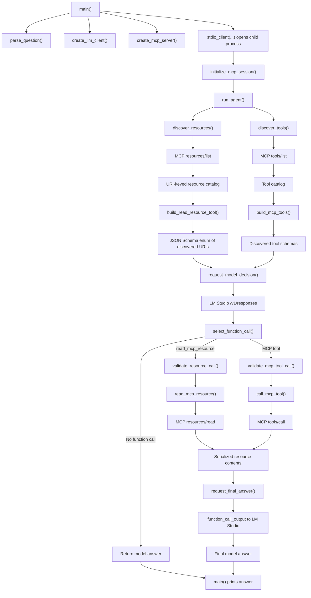

# Minimal MCP Agent Client

This teaching project shows the normally hidden boundary between a model-driven agent loop and an MCP client. A local model served by LM Studio decides whether it needs an advertised MCP resource or tool; the Python agent validates that decision, performs the operation through MCP stdio, and returns the result to the model.

The implementation is intentionally framework-free. Each stage is a named function in [`client.py`](client.py), and the console trace labels every handoff between the user, agent, model, MCP client, and MCP server.

## Architecture

```text
User
  ↕
Dockerized Python agent
  ↔ LM Studio on the host through /v1/responses
  ↔ Phoenix MCP server child process through stdio
```

The agent container does not run Docker internally. Docker Compose mounts the existing Phoenix server and its Markdown state from the sibling `minimal-mcp-teaching-server` repository. The agent launches that mounted Python server directly as a child process.

Expected directory layout:

```text
MCP/
├── minimal-mcp-agent-client/
└── minimal-mcp-teaching-server/
    ├── server.py
    └── project-status.md
```

## Function Flow



### What each function teaches

| Function | Responsibility |
| --- | --- |
| `parse_question()` | Reads the user's question from the CLI. |
| `create_llm_client()` | Configures the OpenAI-compatible client for LM Studio and requires a model ID. |
| `create_mcp_server()` | Describes how the mounted MCP server child process is launched. |
| `initialize_mcp_session()` | Performs the MCP initialization handshake and prints the server identity. |
| `discover_resources()` | Calls `resources/list`, logs the advertised resources, and builds a URI-keyed catalog. |
| `discover_tools()` | Calls `tools/list`, logs every tool, and builds a name-keyed catalog. |
| `build_read_resource_tool()` | Converts the catalog into one model-facing function whose `uri` argument is restricted by a JSON Schema enum. |
| `build_mcp_tools()` | Converts discovered MCP descriptions and input schemas into model-facing functions. |
| `request_model_decision()` | Sends the question and dynamic function definitions to the local model. |
| `select_function_call()` | Finds the model's observable function-call request and rejects multiple calls in this first example. |
| `validate_resource_call()` | Rejects unsupported functions, malformed arguments, and URIs that were not advertised. |
| `validate_mcp_tool_call()` | Rejects undiscovered tools and arguments that do not match the discovered schema. |
| `read_mcp_resource()` | Maps the validated function call to MCP `resources/read` and serializes the returned contents. |
| `call_mcp_tool()` | Maps a validated model function to MCP `tools/call` and serializes its result. |
| `request_final_answer()` | Returns the MCP result to the model as `function_call_output`. |
| `run_agent()` | Coordinates discovery, model routing, resource access, and the final model request. |
| `main()` | Wires configuration and process lifecycles together, then prints the answer. |

## Prerequisites

- Docker Desktop with Docker Compose.
- LM Studio with a model that supports function/tool calling.
- The completed sibling [`minimal-mcp-teaching-server`](../minimal-mcp-teaching-server) repository.
- LM Studio's local API server running on port `1234`.

LM Studio documents both the OpenAI-compatible `/v1/responses` endpoint and custom tool calling. See [OpenAI compatibility](https://lmstudio.ai/docs/developer/openai-compat) and [Tool Use](https://lmstudio.ai/docs/developer/openai-compat/tools).

## LM Studio Setup

1. Open LM Studio.
2. Download and load a tool-capable instruct model.
3. Open the **Developer** tab.
4. Start the local API server on port `1234`.
5. If Docker cannot connect, enable **Serve on Local Network** in LM Studio's server settings.

Confirm the server and find the loaded model identifier:

```bash
curl http://localhost:1234/v1/models
```

Copy the desired model's `id` value. It will be supplied as `LM_STUDIO_MODEL` when the agent runs.

LM Studio does not require authentication by default. The Compose configuration supplies the placeholder API key `lm-studio` because the OpenAI Python client expects a value. If LM Studio authentication is enabled, provide a real LM Studio API token through `OPENAI_API_KEY` instead.

## Build

Run from the agent repository:

```bash
cd /Users/rasool/Desktop/MCP/minimal-mcp-agent-client
docker compose build agent
```

The image installs the exact dependency versions recorded in `uv.lock`. Host Python packages are not installed.

## Run

Ask a question that requires the advertised project-status resource:

```bash
LM_STUDIO_MODEL="mistralai/devstral-small-2-2512" docker compose run --rm -T agent "What is the current status of Project Phoenix?"
```

Ask a question that should not require MCP:

```bash
LM_STUDIO_MODEL="mistralai/devstral-small-2-2512" docker compose run --rm -T agent "What is 2 + 2?"
```

Ask a question that requires an MCP tool:

```bash
LM_STUDIO_MODEL="mistralai/devstral-small-2-2512" docker compose run --rm -T agent "Find Project Phoenix updates written by Raiqa."
```

The first trace should include:

```text
[USER -> AGENT] What is the current status of Project Phoenix?
[MCP CLIENT -> MCP SERVER] initialize
[MCP SERVER -> MCP CLIENT] initialize result ...
[MCP CLIENT -> MCP SERVER] resources/list
[MCP SERVER -> MCP CLIENT] resources/list result
[MCP CLIENT -> MCP SERVER] tools/list
[MCP SERVER -> MCP CLIENT] tools/list result
[AGENT -> MODEL] request tools=...
[MODEL -> AGENT] function call
[AGENT] Mapping read_mcp_resource to MCP resources/read
[MCP CLIENT -> MCP SERVER] resources/read ...
[MCP SERVER -> MCP CLIENT] resources/read result
[AGENT -> MODEL] function_call_output ...
[MODEL -> AGENT] final response
[AGENT -> USER]
```

This is a curated application-level trace, not a raw JSON-RPC capture. The client redirects the child server's stderr to the null device so FastMCP's timestamped framework logs do not duplicate or reorder the teaching trace. MCP protocol messages still travel through the child process's stdout.

The model also receives mutating tools such as `add_project_update`. Calling
one may change the bind-mounted `project-status.md` file without a separate
user-confirmation step.

## Configuration

| Environment variable | Default | Purpose |
| --- | --- | --- |
| `LM_STUDIO_MODEL` | None; required | Model identifier returned by LM Studio's `/v1/models`. |
| `OPENAI_BASE_URL` | `http://host.docker.internal:1234/v1` | OpenAI-compatible endpoint visible from the Docker container. |
| `OPENAI_API_KEY` | `lm-studio` | Placeholder value, or a real LM Studio token when authentication is enabled. |

Example with authentication and a different port:

```bash
LM_STUDIO_MODEL="<model-id>" \
OPENAI_API_KEY="<lm-studio-token>" \
OPENAI_BASE_URL="http://host.docker.internal:5678/v1" \
docker compose run --rm -T agent "Read the current project status."
```

Do not commit real API tokens.

## Dependency Changes

Only run this when `pyproject.toml` changes:

```bash
uv lock
docker compose build agent
```

`uv lock` updates dependency metadata; it does not install packages into the host environment.

## Troubleshooting

### `Set LM_STUDIO_MODEL to the loaded LM Studio model ID`

Run `curl http://localhost:1234/v1/models`, then pass one returned `id` through `LM_STUDIO_MODEL`.

### Connection refused or timeout

- Confirm LM Studio's server is running.
- Confirm it uses port `1234`.
- Enable **Serve on Local Network** if Docker cannot reach it.
- Keep `localhost` for host-side `curl`; the container uses `host.docker.internal`.

### The model answers without reading MCP

Use a tool-capable instruct model and ask a question that clearly requires current project data. The agent intentionally allows unrelated questions to complete without MCP.

### The model requests an invalid URI

The agent rejects it. The model-facing JSON Schema enum and the runtime catalog validation are separate safeguards.

## Current Scope

This checkpoint demonstrates dynamically discovered resources and MCP tools, including mutating tools. It intentionally excludes prompts, Streamable HTTP, progress tokens, memory, multi-agent behavior, deployment, and confirmation before writes. Progress-token handling belongs to the next separate example.
