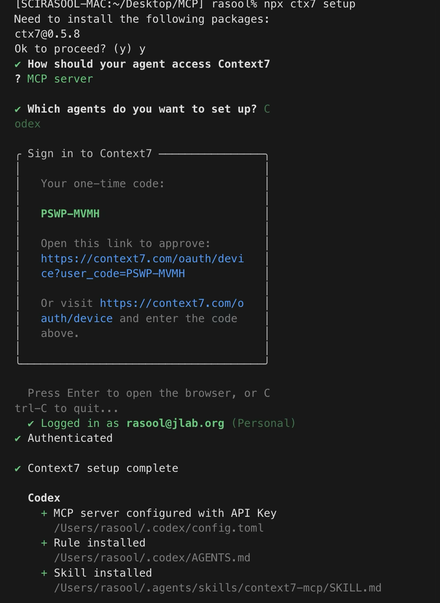

# Context7: Use Current Documentation

## Why this is useful

Library APIs change. Context7 helps Codex retrieve version-relevant documentation instead of relying on remembered syntax or mixed-quality search results.

## Setup

The current official Context7 setup supports a one-command flow with npx ctx7 setup, and it can install in MCP mode. It requires Node.js 18 or newer.

### 1. Confirm your Node.js version

```bash
node --version
```

Continue if the version is 18 or newer.

### 2. Run the Context7 setup

```bash
npx ctx7 setup
```




### 3. Verify the connection from Codex

```bash
codex mcp list
```


normal search without context 7

```text
Google:
"SQLAlchemy async session"
        ↓
Search the whole web
        ↓
sqlalchemy.org
Stack Overflow
Medium
Reddit
old tutorials
random blogs
...
```

Using context 7 directly jump to docs

```text
                    Context7
                       │
              documentation index
                       │
        ┌──────────────┼──────────────┐
        ▼              ▼              ▼
     React          FastAPI       SQLAlchemy
     docs             docs            docs
        │              │              │
        └──────────────┴──────────────┘
                       ▲
                       │
                 Context7 MCP
                       ▲
                       │
                     Codex

Codex → MCP → Context7 → indexed library documentation
```


## Try it

### Retrieve a current SQLAlchemy pattern

```text
Use Context7 to retrieve the current SQLAlchemy 2.x documentation
for creating an AsyncSession and executing a SELECT query.

Show me the recommended code pattern and tell me which Context7
documentation you used.
```


### Inspect the available FastAPI documentation

```text
Using Context7, find the documentation for FastAPI and tell me
what documentation Context7 currently has available for it.
```

## What to notice

- The first prompt requests both a recommended pattern and its documentation source.
- Naming the library version reduces ambiguity.
- Context7 is most valuable when “almost correct” code would still waste time.
